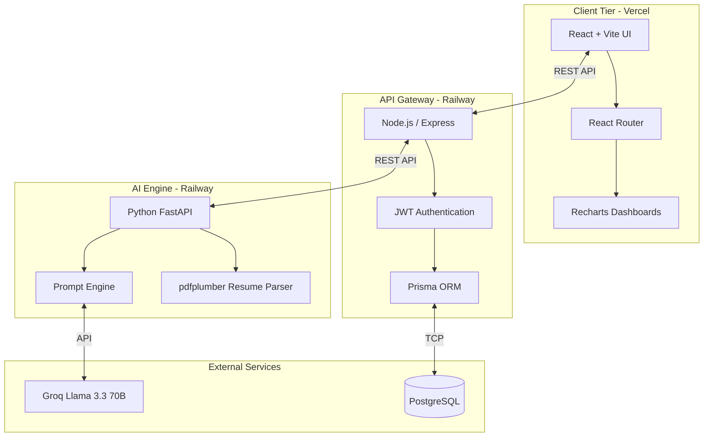

# Architecture & Rationale: SkillForge AI

## 🏗️ Architecture Diagram

---

## 📄 "Why This Works" — 1-Pager

### The Problem with Traditional Assessments
Modern hiring relies on keyword-matching ATS (Applicant Tracking Systems) and static multiple-choice tests. This is fundamentally flawed because:
1. **Candidates can easily cheat** on multiple-choice tests.
2. **Resumes are aspirational**, often listing tools candidates have only touched once.
3. **Static tests don't adapt** to the candidate's actual proficiency level.

### The SkillForge Solution
SkillForge AI solves this by deploying an **adaptive, conversational AI agent** that evaluates candidates the way a Senior Engineer would in a technical interview.

#### 1. Evidence-Based Parsing
Instead of just counting keywords, the Python AI Engine uses `pdfplumber` and Llama-3.3 to extract skills *in context*. It assigns a confidence score based on whether the skill was used in a complex project (high confidence) or just listed in a generic "Skills" section (low confidence).

#### 2. Dynamic Gap Analysis
By instantly comparing the extracted contextual skills against the scraped requirements of the Job Description, the Node.js backend calculates a highly accurate **Readiness Score**. This gives both the recruiter and the candidate immediate visibility into the exact deltas.

#### 3. Conversational Calibration (The Core Innovation)
When a gap is identified, the assessment engine does not serve a generic test. It initiates a conversational Q&A loop.
- If the candidate answers correctly, the AI increases the difficulty of the next question.
- If the candidate struggles, the AI lowers the difficulty to pinpoint their exact baseline.
This completely neutralizes memorization and cheating, proving *actual* proficiency.

#### 4. Actionable, Adjacent Learning
The final output is not just a rejection or a score; it is a **Personalized Learning Roadmap**. The AI analyzes the candidate's existing strengths and plots a path of "adjacent skills" (e.g., if they know React, the roadmap smoothly transitions them to Next.js). It breaks the learning down into realistic time estimates and validates their progress continuously.

### Technical Viability & Scalability
By separating the architecture into three distinct tiers, the system is highly scalable:
- **Frontend (Vercel):** Lightning-fast global CDN delivery for the React application.
- **Node.js Gateway (Railway):** Handles heavy traffic, JWT authentication, and rapid PostgreSQL I/O via Prisma.
- **Python AI Server (Railway):** Dedicated solely to CPU-intensive tasks (OCR parsing) and LLM orchestration, preventing the main backend from blocking the event loop.

SkillForge goes beyond matching keywords—it proves competence and builds capability.
