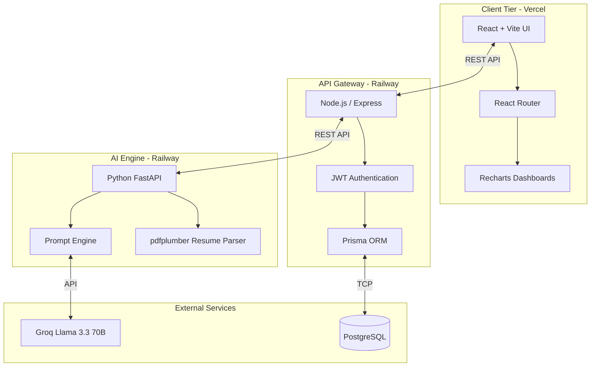

<div align="center">

# ⚡ SkillForge AI
### AI-Powered Skill Assessment & Personalised Learning Agent

[](https://skill-forge-ai-three.vercel.app/)
[](LICENSE)

*A resume tells you what someone claims to know — not how well they actually know it. SkillForge proves it.*

</div>

---

## 📖 Table of Contents
1. [What is SkillForge AI?](#-what-is-skillforge-ai)
2. [Architecture & Workflow](#-architecture--workflow)
3. [Tabulated Tech Stack](#-tabulated-tech-stack)
4. [Scoring Logics & Engine](#-scoring-logics--engine)
5. [Local Setup Instructions](#-local-setup-instructions)
6. [Project Structure](#-project-structure)
7. [API Endpoints](#-api-endpoints)

---

## 🎯 What is SkillForge AI?

SkillForge AI is an intelligent platform built for the **Deccan AI Catalyst Hackathon 2026**. 
Instead of just matching keywords, it takes a candidate's Resume and a Job Description, conducts an adaptive conversational AI interview to test their *actual* knowledge, and generates a step-by-step personalized learning roadmap to fill in the gaps.

### ✨ Key Features
1. **📄 Smart Resume Parsing:** Extracts skills and looks for real evidence (e.g., used in projects vs. just listed).
2. **🏢 Job Description Scraping:** Paste text, upload a PDF, or parse a job URL.
3. **📊 Gap Analysis:** Instantly compares the candidate's skills against the JD.
4. **🧠 Adaptive AI Assessment:** A conversational interview that adjusts difficulty based on answers.
5. **🗺️ Personalized Roadmaps:** Generates an ordered learning plan with curated resources.
6. **🎤 Mock Interviews:** Practice for the real thing with AI-generated role-specific questions.

---

## 🏗️ Architecture & Workflow

SkillForge uses a robust 3-tier microservice architecture to decouple CPU-intensive LLM/OCR operations from the main API Gateway.



---

## 💻 Tabulated Tech Stack

| Tier | Technology | Purpose |
|------|------------|---------|
| **Frontend** | React + Vite | Lightning-fast client-side rendering. |
| **Frontend** | Recharts & Framer Motion | Data visualization (Radar/Bar charts) and smooth UI animations. |
| **API Gateway**| Node.js + Express | Handles user auth, routing, and database communication. |
| **Database** | PostgreSQL + Prisma ORM | Relational data persistence and schema management. |
| **AI Server** | Python + FastAPI | High-performance asynchronous AI orchestration and OCR processing. |
| **AI Models** | Groq API (Llama 3.3 70B) | Ultra-fast LLM inference for adaptive questioning and JSON generation. |
| **Document** | `pdfplumber` | Precise, layout-aware PDF text extraction for resumes. |
| **Infra** | Docker Compose | Containerized local development environment. |

---

## 🧠 Scoring Logics & Engine

SkillForge uses proprietary algorithms to determine candidate readiness rather than basic keyword matching.

### 1. Contextual Evidence Extraction
When parsing a resume, the LLM analyzes the *context* of a skill. 
- **High Confidence (80-100%):** Skill is used in a complex project with measurable impact.
- **Medium Confidence (40-70%):** Skill is mentioned in work experience but lacks depth.
- **Low Confidence (10-30%):** Skill is simply listed in a comma-separated "Skills" section.

### 2. Gap Analysis & Readiness Score
The initial Readiness Score is calculated by overlapping the JD required skills against the Resume extracted skills.
- Missing skills heavily penalize the score.
- Existing skills contribute to the score weighted by their Confidence levels.

### 3. Adaptive Calibration Assessment
During the technical assessment, the difficulty calibrates dynamically:
- Answers graded **< 3/5**: Next question difficulty decreases to find the candidate's exact baseline.
- Answers graded **>= 3/5**: Next question difficulty increases.
This totally neutralizes memorization and cheating, determining absolute proficiency. Validating a skill permanently upgrades its global confidence score to 100%.

---

## 🚀 Local Setup Instructions

You can run the entire application (Frontend, Backend, AI Server, and Database) with just one command.

### Prerequisites
- Docker & Docker Compose installed
- A free [Groq API Key](https://console.groq.com/keys)

### Setup Steps
1. **Clone the repository:**
   ```bash
   git clone https://github.com/Kedareswar13/SkillForge-AI.git
   cd SkillForge-AI
   ```
2. **Add your API Key:**
   Open the `ai-server/` folder, create a file named `.env`, and add your Groq API key:
   ```env
   GROQ_API_KEY=gsk_your_api_key_here
   ```
3. **Run the application:**
   ```bash
   docker-compose up --build
   ```
4. **Open the app:** Visit **[http://localhost:3000](http://localhost:3000)** in your browser!

---

## 📂 Project Structure

```text
SkillForge-AI/
├── ai-server/               # Python FastAPI Microservice
│   ├── app/
│   │   ├── routes/          # AI logic (Resume, JD, Assessment, Learning)
│   │   └── main.py          # FastAPI Entry Point
│   ├── requirements.txt     # Python Dependencies
│   └── Dockerfile
├── backend/                 # Node.js API Gateway
│   ├── prisma/              # PostgreSQL Schema & Migrations
│   ├── src/
│   │   ├── routes/          # API Gateway Routes
│   │   ├── middleware/      # JWT Auth Middleware
│   │   └── index.js         # Express Entry Point
│   ├── package.json
│   └── Dockerfile
├── frontend/                # React UI
│   ├── src/
│   │   ├── components/      # Reusable UI widgets
│   │   ├── pages/           # Dashboard, Assessment, Roadmap
│   │   └── api.js           # Axios Interceptors
│   ├── vite.config.js
│   └── Dockerfile
└── docker-compose.yml       # Orchestrates all 4 containers (including DB)
```

---

## 🔌 API Endpoints

### Gateway (Node.js) - Port 5000
| Method | Endpoint | Description |
|--------|----------|-------------|
| `POST` | `/api/auth/signup` | Register a new user |
| `POST` | `/api/auth/login` | Authenticate user and return JWT |
| `POST` | `/api/resume/upload` | Upload PDF resume to processing queue |
| `POST` | `/api/analyze` | Trigger Gap Analysis and Readiness calc |
| `POST` | `/api/assessment/answer`| Submit an answer to the technical test |
| `PUT`  | `/api/learning-plan/:idx/progress` | Sync roadmap progress & bump readiness |

### AI Engine (FastAPI) - Port 8000
*(Note: These are called internally by the Node.js Gateway)*
| Method | Endpoint | Description |
|--------|----------|-------------|
| `POST` | `/api/resume/parse` | OCR extraction and JSON structuring |
| `POST` | `/api/assessment/question`| Generates adaptive questions via LLM |
| `POST` | `/api/assessment/evaluate`| Grades answers with continuous feedback |
| `POST` | `/api/learning/generate` | Generates DAG-based curriculum |

---

## 👨‍💻 Built By
**Pattapu Kedareswar**
- GitHub: [@Kedareswar13](https://github.com/Kedareswar13)
- Built for the Deccan AI Catalyst Hackathon 2026
